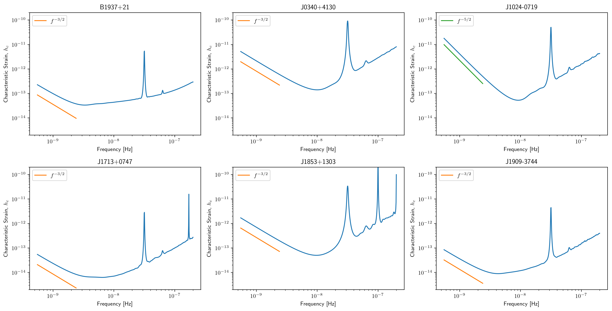
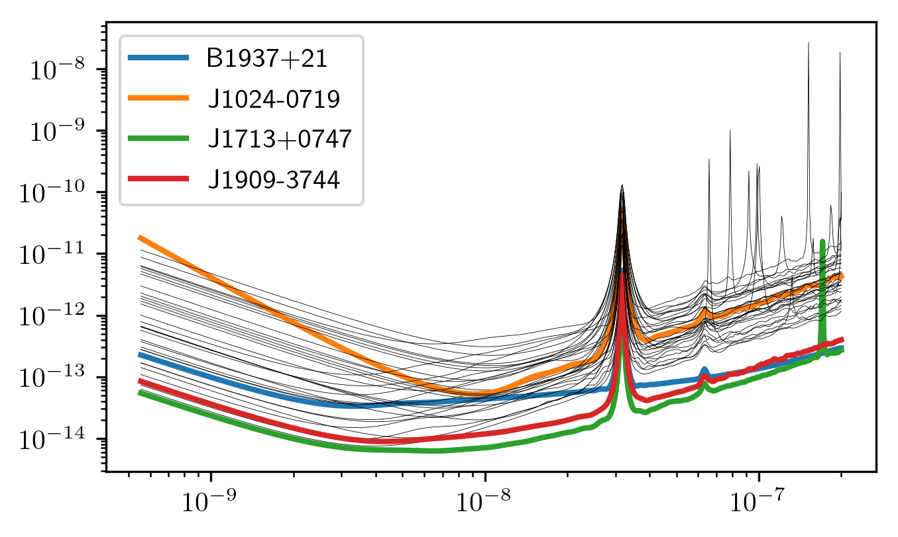
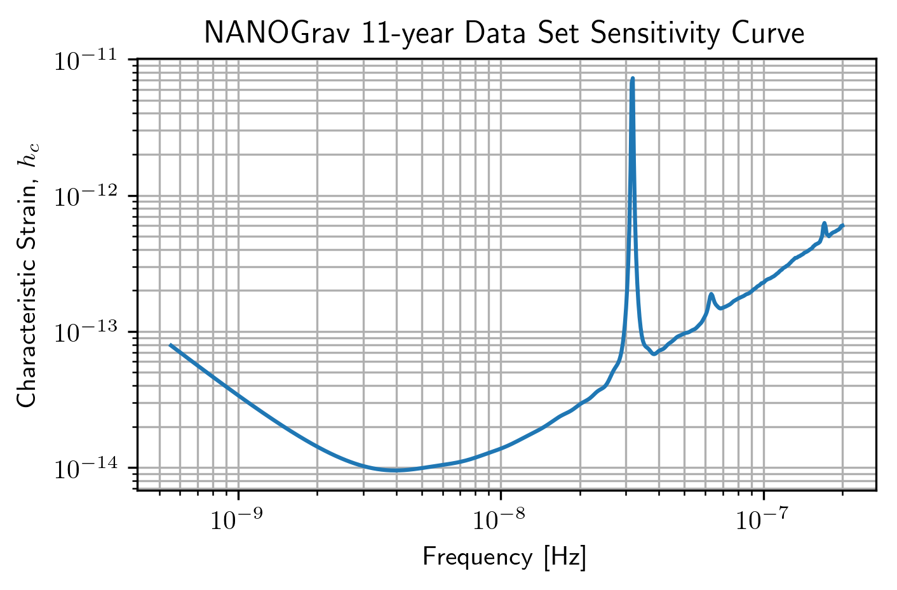
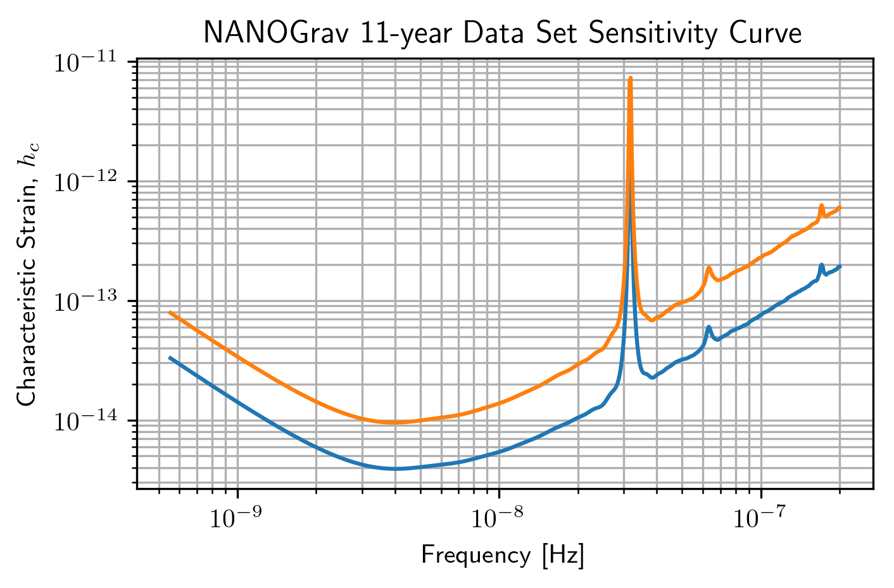
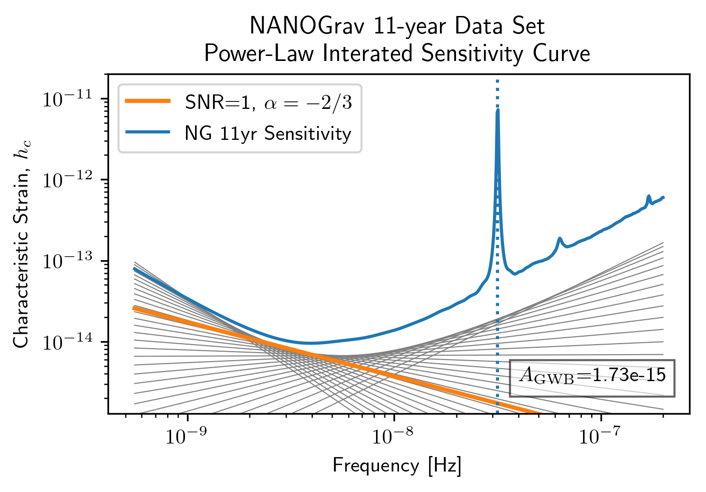
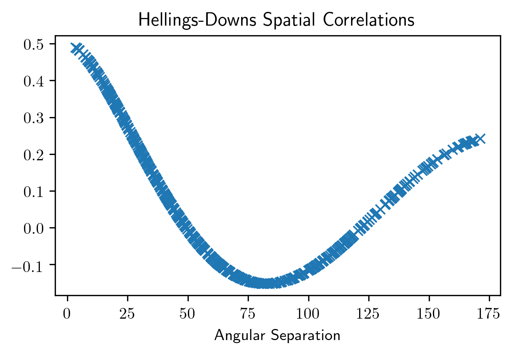
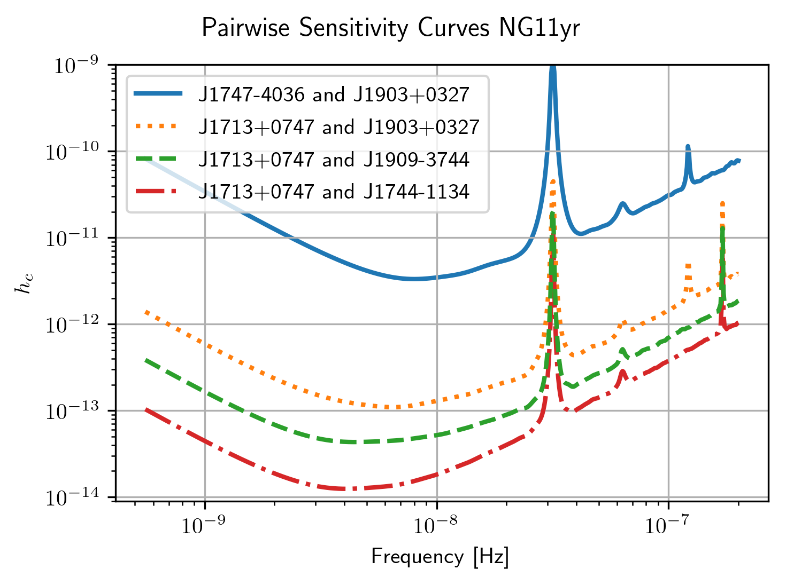
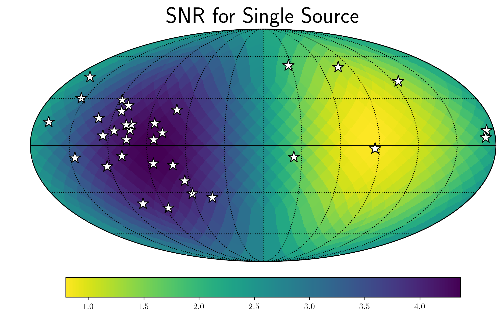
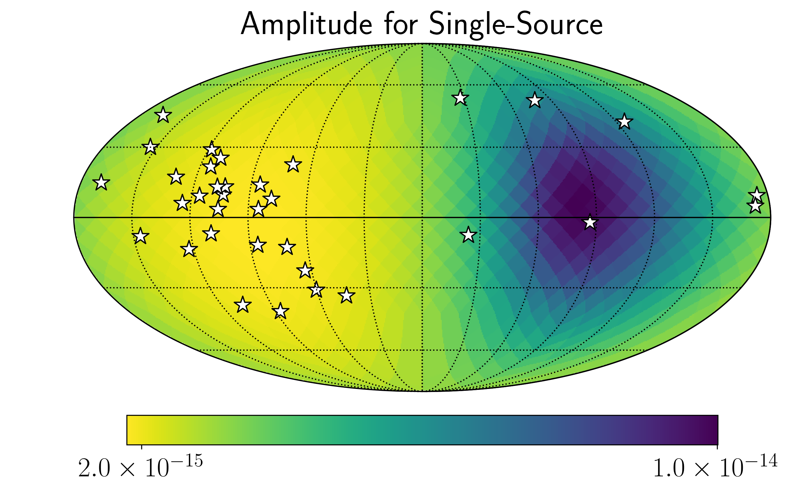
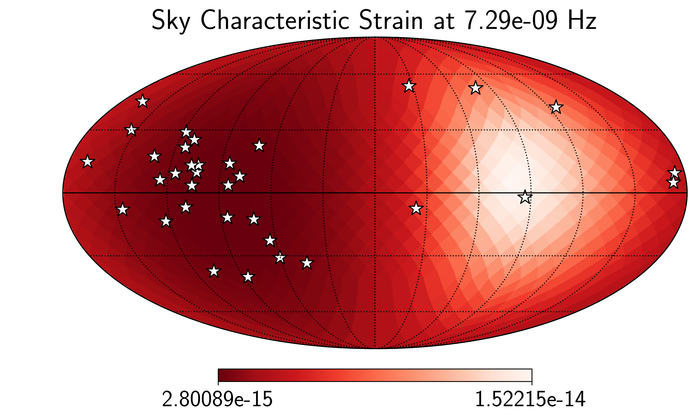

.. module:: hasasia

.. note:: This tutorial was generated from a Jupyter notebook that can be
          downloaded `here <_static/notebooks/real_data_tutorial.ipynb>`_.

.. _real_data_tutorial:

Real Pulsar Timing Array Data Tutorial
======================================

Here we present the details of using real ``par/tim`` files, as often
provided publicly by Pulsar Timing Array collaborations, to construct
senstivity curves. The ``hasasia`` code base deals with real data as
easily as simulated date. The most challenging part of the code will be
getting the data into a format compatible with ``hasasia``.

First we import some important modules.

.. code:: python

    import numpy as np
    import matplotlib.pyplot as plt
    %matplotlib inline

.. code:: python

    import glob, pickle, json

.. code:: python

    import hasasia.sensitivity as hsen
    import hasasia.sim as hsim
    import hasasia.skymap as hsky

.. code:: python

    import matplotlib as mpl
    mpl.rcParams['figure.dpi'] = 300
    mpl.rcParams['figure.figsize'] = [5,3]
    mpl.rcParams['text.usetex'] = True

Making ``hasasia.Pulsar`` objects with real data.
-------------------------------------------------

Here we use the Python-based pulsar timing data analysis package
`enterprise <https://github.com/nanograv/enterprise>`__. We choose this
software, as it has a Pulsar class well suited for dealing with the
needs of our code base. In particular the pulsar TOAs, errors, and sky
positions are handled cleanly. The sky positions are converted into
ecliptic longitude and co-latitude, which are the angles taken as input
by ``hasasia``.

.. code:: python

    from enterprise.pulsar import Pulsar as ePulsar

The following paths point to the location of the data files (tim),
parameter files (par) and noise files.

.. code:: python

    pardir = '/Users/hazboun/GoogleDrive/NANOGrav_Detection/data/nanograv/11yr_v2/'
    timdir = '/Users/hazboun/GoogleDrive/NANOGrav_Detection/data/nanograv/11yr_v2/'
    noise_dir = '/Users/hazboun/GoogleDrive/NANOGrav_Detection/11yr_stochastic_analysis'
    noise_dir += '/nano11y_data/noisefiles/'
    pars = sorted(glob.glob(pardir+'*.par'))
    tims = sorted(glob.glob(timdir+'*.tim'))
    noise_files = sorted(glob.glob(noise_dir+'*.json'))

Here we load the list of pulsars included in the NANOGrav 11-year
analysis. This includes the pulsars in the dataset with longer than
3-year baselines.

.. code:: python

    psr_list = np.load('/Users/hazboun/GoogleDrive/NANOGrav_Detection/SlicedData/PSR_by_Obs_dict.npy')
    psr_list = psr_list[-1]['psr_names']

.. code:: python

    def get_psrname(file,name_sep='_'):
        return file.split('/')[-1].split(name_sep)[0]

.. code:: python

    pars = [f for f in pars if get_psrname(f) in psr_list]
    tims = [f for f in tims if get_psrname(f) in psr_list]
    noise_files = [f for f in noise_files if get_psrname(f) in psr_list]
    len(pars), len(tims), len(noise_files)

.. parsed-literal::

    (34, 34, 34)

Here we collate the noise parameters into one large dictionary.

.. code:: python

    noise = {}
    
    for nf in noise_files:
        with open(nf,'r') as fin:
            noise.update(json.load(fin))

The following loop loads the pulsars into ``enterprise.pulsar.Pulsar``
class instances. This uses a pulsar timing package in the background,
either ``Pint`` or ``TEMPO2`` (via the Python wrapper ``libstempo``).

Note that warnings about pulsar distances are usual and do not affect
this analysis.

.. code:: python

    ePsrs = []
    for par,tim in zip(pars,tims):
        ePsr = ePulsar(par, tim,  ephem='DE436')
        ePsrs.append(ePsr)
        print('\rPSR {0} complete'.format(ePsr.name),end='',flush=True)

.. parsed-literal::

    PSR B1953+29 completeWARNING: Could not find pulsar distance for PSR J0023+0923. Setting value to 1 with 20% uncertainty.
    PSR J0030+0451 completeWARNING: Could not find pulsar distance for PSR J0340+4130. Setting value to 1 with 20% uncertainty.
    PSR J0613-0200 completeWARNING: Could not find pulsar distance for PSR J0645+5158. Setting value to 1 with 20% uncertainty.
    PSR J1600-3053 completeWARNING: Could not find pulsar distance for PSR J1614-2230. Setting value to 1 with 20% uncertainty.
    PSR J1713+0747 completeWARNING: Could not find pulsar distance for PSR J1738+0333. Setting value to 1 with 20% uncertainty.
    PSR J1738+0333 completeWARNING: Could not find pulsar distance for PSR J1741+1351. Setting value to 1 with 20% uncertainty.
    PSR J1744-1134 completeWARNING: Could not find pulsar distance for PSR J1747-4036. Setting value to 1 with 20% uncertainty.
    PSR J1747-4036 completeWARNING: Could not find pulsar distance for PSR J1853+1303. Setting value to 1 with 20% uncertainty.
    PSR J1853+1303 completeWARNING: Could not find pulsar distance for PSR J1903+0327. Setting value to 1 with 20% uncertainty.
    PSR J1918-0642 completeWARNING: Could not find pulsar distance for PSR J1923+2515. Setting value to 1 with 20% uncertainty.
    PSR J1923+2515 completeWARNING: Could not find pulsar distance for PSR J1944+0907. Setting value to 1 with 20% uncertainty.
    PSR J1944+0907 completeWARNING: Could not find pulsar distance for PSR J2010-1323. Setting value to 1 with 20% uncertainty.
    PSR J2010-1323 completeWARNING: Could not find pulsar distance for PSR J2017+0603. Setting value to 1 with 20% uncertainty.
    PSR J2017+0603 completeWARNING: Could not find pulsar distance for PSR J2043+1711. Setting value to 1 with 20% uncertainty.
    PSR J2145-0750 completeWARNING: Could not find pulsar distance for PSR J2214+3000. Setting value to 1 with 20% uncertainty.
    PSR J2214+3000 completeWARNING: Could not find pulsar distance for PSR J2302+4442. Setting value to 1 with 20% uncertainty.
    PSR J2317+1439 complete

Constructing the Correlation Matrix
~~~~~~~~~~~~~~~~~~~~~~~~~~~~~~~~~~~

The following function makes a correlation matrix using the NANOGrav
noise model and the parameters furnished in the data analysis release.
For a detailed treatment of the noise modeling see `Lam, et al.,
2015 <>`__.

.. code:: python

    def make_corr(psr):
        N = psr.toaerrs.size
        corr = np.zeros((N,N))
        _, _, U = hsen.quantize_fast(psr.toas,psr.toaerrs,dt=1)
        u = np.matmul(U,U.T)
        keys = [ky for ky in noise.keys() if psr.name in ky]
        backends = np.unique(psr.flags['f'])
        sigma_sqr = np.zeros(N)
        ecorrs = np.zeros(N)
        for be in backends:
            mask = np.where(ePsr.flags['f']==be)
            key_ec = '{0}_{1}_log10_{2}'.format(psr.name,be,'ecorr')
            ecorrs[mask] = np.ones_like(mask) * (10**noise[key_ec])**2
            key_ef = '{0}_{1}_{2}'.format(psr.name,be,'efac')
            key_eq = '{0}_{1}_log10_{2}'.format(psr.name,be,'equad')
            sigma_sqr[mask] = (noise[key_ef]**2 * (psr.toaerrs[mask]**2)
                               + (10**noise[key_eq])**2)
        
        corr = np.diag(sigma_sqr) + np.diag(u*ecorrs**2)
        return corr

Below we enter the red noise values from the NANOGrav 11-year data set
release paper. These were the only pulsars in that paper that were
deemed significant in that analysis.

.. code:: python

    rn_psrs = {'B1855+09':[10**-13.7707, 3.6081],
               'B1937+21':[10**-13.2393, 2.46521],
               'J0030+0451':[10**-14.0649, 4.15366],
               'J0613-0200':[10**-13.1403, 1.24571],
               'J1012+5307':[10**-12.6833, 0.975424],
               'J1643-1224':[10**-12.245, 1.32361],
               'J1713+0747':[10**-14.3746, 3.06793],
               'J1747-4036':[10**-12.2165, 1.40842],
               'J1903+0327':[10**-12.2461, 2.16108],
               'J1909-3744':[10**-13.9429, 2.38219],
               'J2145-0750':[10**-12.6893, 1.32307],
               }

The following function retrieves the time span across the full set of
pulsars.

.. code:: python

    Tspan = hsen.get_Tspan(ePsrs)

Set the frequency array across which to calculate the red noise and
sensitivity curves.

.. code:: python

    fyr = 1/(365.25*24*3600)
    freqs = np.logspace(np.log10(1/(5*Tspan)),np.log10(2e-7),600)

Constructing the Array
~~~~~~~~~~~~~~~~~~~~~~

Here we instantiate ``hasasia.Pulsar`` class instances using those from
``enterprise``. The ``make_corr`` function constructs a noise
correlation matrix based on the noise model used by the NANOGrav
collaboration.

Note that the TOAs (and hence the TOA erros and design matrix) are
thinnned by a factor of ten. NANOGrav keeps many TOAs from a given
observation (often >50), which are not necessary to characterize the
sensitivity of the PTA. The differences in these TOAs would only be
needed to characterize frequencies much higher than investigated here.

.. code:: python

    psrs = []
    thin = 10
    for ePsr in ePsrs:
        corr = make_corr(ePsr)[::thin,::thin]
        plaw = hsen.red_noise_powerlaw(A=9e-16, gamma=13/3., freqs=freqs)
        if ePsr.name in rn_psrs.keys():
            Amp, gam = rn_psrs[ePsr.name]
            plaw += hsen.red_noise_powerlaw(A=Amp, gamma=gam, freqs=freqs)
            
        corr += hsen.corr_from_psd(freqs=freqs, psd=plaw,
                                   toas=ePsr.toas[::thin])
        psr = hsen.Pulsar(toas=ePsr.toas[::thin],
                          toaerrs=ePsr.toaerrs[::thin],
                          phi=ePsr.phi,theta=ePsr.theta, 
                          N=corr, designmatrix=ePsr.Mmat[::thin,:])
        psr.name = ePsr.name
        psrs.append(psr)
        del ePsr
        print('\rPSR {0} complete'.format(psr.name),end='',flush=True)

.. parsed-literal::

    PSR J2317+1439 complete

The next step instantiates a ``hasasia.Spectrum`` class instance for
each pulsar. We also calculate the inverse-noie-weighted transmission
function, though this is not necessary.

.. code:: python

    specs = []
    for p in psrs:
        sp = hsen.Spectrum(p, freqs=freqs)
        _ = sp.NcalInv
        specs.append(sp)
        print('\rPSR {0} complete'.format(p.name),end='',flush=True)

.. parsed-literal::

    PSR J2317+1439 complete

Individual Pulsar Sensitivity Curves
~~~~~~~~~~~~~~~~~~~~~~~~~~~~~~~~~~~~

Here we plot a sample of individual pulsar sensitivity curves.

.. code:: python

    fig=plt.figure(figsize=[15,45])
    j = 1
    names = ['B1937+21','J0340+4130','J1024-0719',
             'J1713+0747','J1853+1303','J1909-3744',]
    for sp,p in zip(specs,psrs):
        if p.name in names:
            fig.add_subplot(12,3,j)
            a = sp.h_c[0]/2*1e-14
            if p.name == 'J1024-0719':
                alp = -5/2
                a *= 8e-10
                plt.loglog(sp.freqs[:150],a*(sp.freqs[:150])**(alp),
                           color='C2',label=r'$f^{-5/2}$')
            else:
                alp = -3/2
                plt.loglog(sp.freqs[:150],a*(sp.freqs[:150])**(alp),
                           color='C1',label=r'$f^{-3/2}$')
            plt.ylim(2e-15,2e-10)
            plt.loglog(sp.freqs,sp.h_c, color='C0')
            plt.rc('text', usetex=True)
            plt.xlabel('Frequency [Hz]')
            plt.ylabel('Characteristic Strain, $h_c$')
            plt.legend(loc='upper left')
            plt.title(p.name)
            j+=1
    fig.tight_layout()
    plt.show()
    plt.close()

Below sensitivity curves of the full PTA are plotted, with a few pulsars
highlighted.

.. code:: python

    names = ['J1713+0747','B1937+21','J1909-3744','J1024-0719']
    for sp,p in zip(specs,psrs):
        if p.name in names:
            plt.loglog(sp.freqs,sp.h_c,lw=2,label=p.name)
        else:
            plt.loglog(sp.freqs,sp.h_c, color='k',lw=0.2)
    
    plt.legend()
    plt.show()
    plt.close()

PTA Sensitivity Curves
----------------------

Full PTA sensitivity curves are constructed by passing a list of
``Spectrum`` instances to either the ``GWBSensitivity`` class or
``DeterSensitivity`` class. See the Sensitivity Curve class for more
details.

.. code:: python

    ng11yr_sc = hsen.GWBSensitivityCurve(specs)

.. code:: python

    plt.loglog(ng11yr_sc.freqs,ng11yr_sc.h_c)
    plt.xlabel('Frequency [Hz]')
    plt.ylabel('Characteristic Strain, $h_c$')
    plt.title('NANOGrav 11-year Data Set Sensitivity Curve')
    plt.grid(which='both')
    # plt.ylim(1e-15,9e-12)
    plt.show()

.. code:: python

    ng11yr_dsc = hsen.DeterSensitivityCurve(specs)

.. code:: python

    plt.loglog(ng11yr_dsc.freqs,ng11yr_dsc.h_c,label='Deterministic')
    plt.loglog(ng11yr_sc.freqs,ng11yr_sc.h_c,label='Stochastic')
    plt.xlabel('Frequency [Hz]')
    plt.ylabel('Characteristic Strain, $h_c$')
    plt.title('NANOGrav 11-year Data Set Sensitivity Curve')
    plt.grid(which='both')
    # plt.ylim(1e-15,9e-12)
    plt.show()

Power-Law Integrated Sensitivity Curves
---------------------------------------

The ``hasasia.sensitivity`` module also contains functionality for
calculating power-law integrated sensitivity curves. These can be used
to calculate the sensitivity to a power-law GWB with a specific spectral
or index, or an array of them.

.. code:: python

    #First for alpha=-2/3 (the default value).
    SNR=1
    hgw=hsen.Agwb_from_Seff_plaw(ng11yr_sc.freqs,
                                 Tspan=Tspan,
                                 SNR=SNR,
                                 S_eff=ng11yr_sc.S_eff)
    plaw_h = hgw*(ng11yr_sc.freqs/fyr)**(-2/3)
    
    #And for an array of alpha values. 
    alpha = np.linspace(-7/4,5/4,30)
    h=hsen.Agwb_from_Seff_plaw(freqs=ng11yr_sc.freqs,Tspan=Tspan,SNR=SNR,
                               S_eff=ng11yr_sc.S_eff,alpha=alpha)
    
    plaw = np.dot((ng11yr_sc.freqs[:,np.newaxis]/fyr)**alpha,
                  h[:,np.newaxis]*np.eye(30))

.. code:: python

    for ii in range(len(h)):
        plt.loglog(ng11yr_sc.freqs,plaw[:,ii],
                   color='gray',lw=0.5)
    plt.loglog(ng11yr_sc.freqs,plaw_h,color='C1',lw=2,
               label='SNR={0}, '.format(SNR)+r'$\alpha=-2/3$')  
    plt.loglog(ng11yr_sc.freqs,ng11yr_sc.h_c, label='NG 11yr Sensitivity')
    plt.xlabel('Frequency [Hz]')
    plt.ylabel('Characteristic Strain, $h_c$')
    plt.axvline(fyr,linestyle=':')
    plt.rc('text', usetex=True)
    plt.title('NANOGrav 11-year Data Set\nPower-Law Interated Sensitivity Curve')
    plt.ylim(hgw*0.75,2e-11)
    plt.text(x=4e-8,y=3e-15,
             s=r'$A_{\rm GWB}$='+'{0:1.2e}'.format(hgw),
             bbox=dict(facecolor='white', alpha=0.6))
    plt.legend(loc='upper left')
    plt.show()

Hellings-Downs Curve
~~~~~~~~~~~~~~~~~~~~

The sensitivity curve classes have all of the information needed to make
a Hellings-Downs curve for the pulsar pairs in the PTA.

.. code:: python

    ThetaIJ,chiIJ,_,_=hsen.HellingsDownsCoeff(ng11yr_sc.phis,ng11yr_sc.thetas)
    plt.plot(np.rad2deg(ThetaIJ),chiIJ,'x')
    plt.title('Hellings-Downs Spatial Correlations')
    plt.xlabel('Angular Separation')
    plt.show()

Pairwise Sensitivity Curves
~~~~~~~~~~~~~~~~~~~~~~~~~~~

The use can also access the pairwise sensitivity curves through the full
PTA ``GWBSensitivityCurve``.

.. code:: python

    psr_names = [p.name for p in psrs]

.. code:: python

    fig=plt.figure(figsize=[5,3.5])
    j = 0
    col = ['C0','C1','C2','C3']
    linestyle = ['-',':','--','-.']
    for nn,(ii,jj) in enumerate(zip(ng11yr_sc.pairs[0],ng11yr_sc.pairs[1])):
        pair = psr_names[ii], psr_names[jj]
        if ('J1747-4036' in pair and 'J1903+0327' in pair):
            lbl = '{0} and {1}'.format(psr_names[ii],psr_names[jj])
            plt.loglog(ng11yr_sc.freqs,
                       np.sqrt(ng11yr_sc.S_effIJ[nn]*ng11yr_sc.freqs),
                       label=lbl,lw=2, color=col[j],linestyle=linestyle[j],
                       zorder=1)
            j+=1
            
    for nn,(ii,jj) in enumerate(zip(ng11yr_sc.pairs[0],ng11yr_sc.pairs[1])):
        pair = psr_names[ii], psr_names[jj]
        if ('J1713+0747' in pair and 'J1903+0327' in pair):
            lbl = '{0} and {1}'.format(psr_names[ii],psr_names[jj])
            plt.loglog(ng11yr_sc.freqs,
                       np.sqrt(ng11yr_sc.S_effIJ[nn]*ng11yr_sc.freqs),
                       label=lbl,lw=2, color=col[j],linestyle=linestyle[j],
                       zorder=2)
            j+=1
            
    for nn,(ii,jj) in enumerate(zip(ng11yr_sc.pairs[0],ng11yr_sc.pairs[1])):
        pair = psr_names[ii], psr_names[jj]
        if ('J1713+0747' in pair and 'J1909-3744' in pair):
            lbl = '{0} and {1}'.format(psr_names[ii],psr_names[jj])
            plt.loglog(ng11yr_sc.freqs,
                       np.sqrt(ng11yr_sc.S_effIJ[nn]*ng11yr_sc.freqs),
                       label=lbl,lw=2, color=col[j],linestyle=linestyle[j],
                       zorder=4)
            j+=1   
            
    for nn,(ii,jj) in enumerate(zip(ng11yr_sc.pairs[0],ng11yr_sc.pairs[1])):
        pair = psr_names[ii], psr_names[jj]
        if ('J1713+0747' in pair and 'J1744-1134' in pair):
            lbl = '{0} and {1}'.format(psr_names[ii],psr_names[jj])
            plt.loglog(ng11yr_sc.freqs,
                       np.sqrt(ng11yr_sc.S_effIJ[nn]*ng11yr_sc.freqs),
                       label=lbl,lw=2, color=col[j],linestyle=linestyle[j],
                       zorder=3)
            j+=1        
    
    plt.rc('text', usetex=True)
    plt.xlabel('Frequency [Hz]')
    plt.ylabel('$h_c$')
    plt.ylim(9e-15,1e-9)
    plt.legend(loc='upper left')
    plt.grid()
    # plt.rcParams.update({'font.size':11})
    fig.suptitle('Pairwise Sensitivity Curves NG11yr',y=1.03)
    fig.tight_layout()
    plt.show()
    plt.close()

SkySensitivity with Real Data
-----------------------------

Here we recap the SkySensitivity tutorial using the real NANOGrav data.
See the ``SkySenstivity`` tutorial for more details.

.. code:: python

    #healpy imports
    import healpy as hp
    import astropy.units as u
    import astropy.constants as c

.. code:: python

    NSIDE = 8
    NPIX = hp.nside2npix(NSIDE)
    IPIX = np.arange(NPIX)
    theta_gw, phi_gw = hp.pix2ang(nside=NSIDE,ipix=IPIX)

.. code:: python

    SM = hsky.SkySensitivity(specs,theta_gw, phi_gw)

.. code:: python

    min_idx = np.argmin(ng11yr_sc.S_eff)

.. code:: python

    idx = min_idx
    hp.mollview(SM.S_effSky[idx],
                title="Sky Sensitivity at {0:2.2e} Hz".format(SM.freqs[idx]),
                cmap='Reds_r',rot=(180,0,0))
    hp.visufunc.projscatter(SM.thetas,SM.phis,marker='*',
                            color='white',edgecolors='k',s=100)
    hp.graticule()
    plt.show()

.. parsed-literal::

    0.0 180.0 -180.0 180.0
    The interval between parallels is 30 deg -0.00'.
    The interval between meridians is 30 deg -0.00'.

.. image:: real_data_tutorial_files/real_data_tutorial_52_1.png

.. code:: python

    f0=8e-9
    hcw = hsky.h_circ(1e9,120,f0,Tspan,SM.freqs).to('').value
    SkySNR = SM.SNR(hcw)

.. code:: python

    plt.rc('text', usetex=True)
    hp.mollview(SkySNR,rot=(180,0,0),#np.log10(1/SM.Sn[idx]),"SNR with Single Source"
                cmap='viridis_r',cbar=None,title='')
    hp.visufunc.projscatter(SM.thetas,SM.phis,marker='*',
                            color='white',edgecolors='k',s=200)
    hp.graticule()
    fig = plt.gcf()
    ax = plt.gca()
    image = ax.get_images()[0]
    cmap = fig.colorbar(image, ax=ax,orientation='horizontal',shrink=0.8,pad=0.05)
    
    plt.rcParams.update({'font.size':22,'text.usetex':True})
    ax.set_title("SNR for Single Source")
    plt.show()

.. parsed-literal::

    0.0 180.0 -180.0 180.0
    The interval between parallels is 30 deg -0.00'.
    The interval between meridians is 30 deg -0.00'.

.. code:: python

    import matplotlib.ticker as ticker

.. code:: python

    hdivA= hcw / hsky.h0_circ(1e9,120,f0)
    Agw = SM.A_gwb(hdivA).to('').value

.. code:: python

    idx = min_idx
    hp.mollview(Agw,rot=(180,0,0),
                title="",cbar=None,
                cmap='viridis_r')
    hp.visufunc.projscatter(SM.thetas,SM.phis,marker='*',
                            color='white',edgecolors='k',s=200)
    hp.graticule()
    # 
    fig = plt.gcf()
    ax = plt.gca()
    image = ax.get_images()[0]
    cbar_ticks = [2.02e-15,1e-14]
    
    plt.rcParams.update({'font.size':22,'text.usetex':True})
    def fmt(x, pos):
        a, b = '{:.1e}'.format(x).split('e')
        b = int(b)
        return r'${} \times 10^{{{}}}$'.format(a, b)
    ax.set_title("Amplitude for Single-Source")
    cmap = fig.colorbar(image, ax=ax,orientation='horizontal',
                        ticks=cbar_ticks,shrink=0.8,
                        format=ticker.FuncFormatter(fmt),pad=0.05)
    plt.show()

.. parsed-literal::

    0.0 180.0 -180.0 180.0
    The interval between parallels is 30 deg -0.00'.
    The interval between meridians is 30 deg -0.00'.

.. code:: python

    idx = min_idx
    hp.mollview(SM.h_c[idx],
                title="Sky Characteristic Strain at {0:2.2e} Hz".format(SM.freqs[idx]),
                cmap='Reds_r',rot=(180,0,0))
    hp.visufunc.projscatter(SM.thetas,SM.phis,marker='*',
                            color='white',edgecolors='k',s=200)
    hp.graticule()
    plt.show()

.. parsed-literal::

    0.0 180.0 -180.0 180.0
    The interval between parallels is 30 deg -0.00'.
    The interval between meridians is 30 deg -0.00'.

