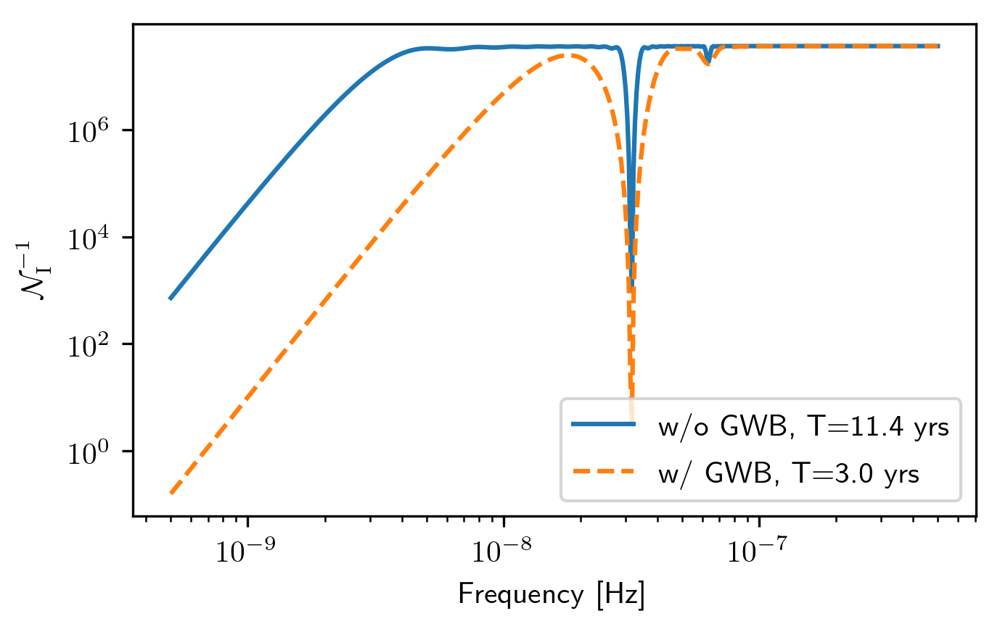
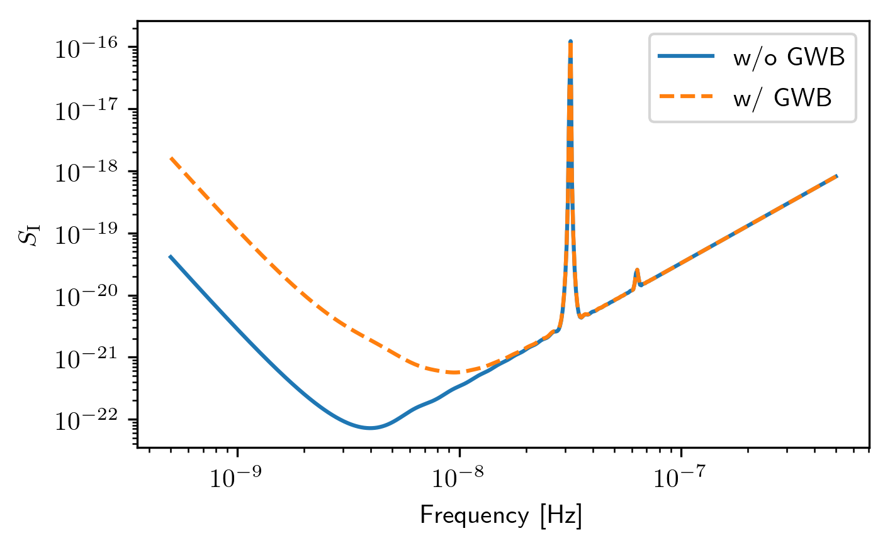
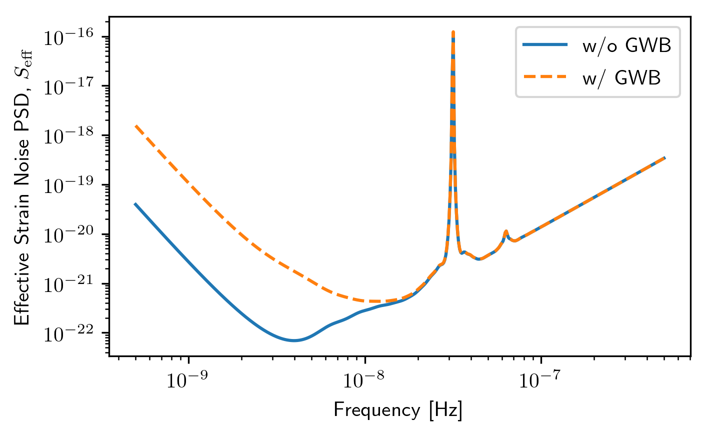
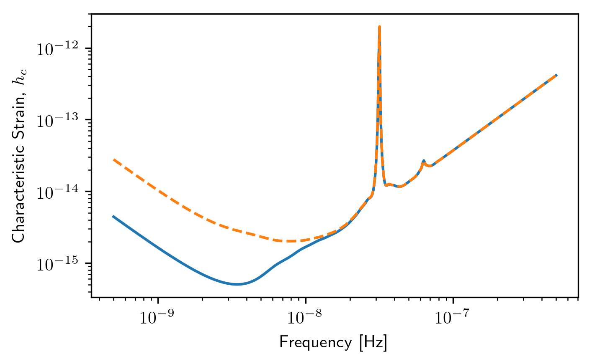
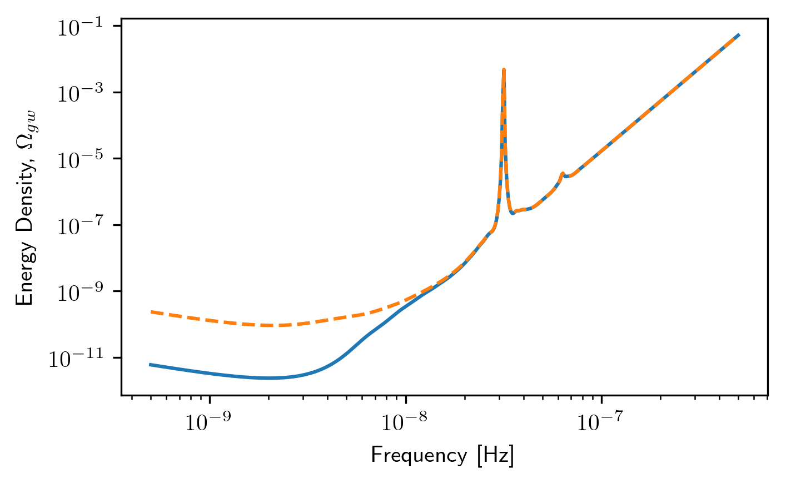
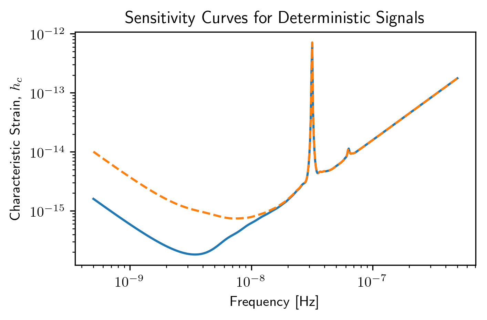
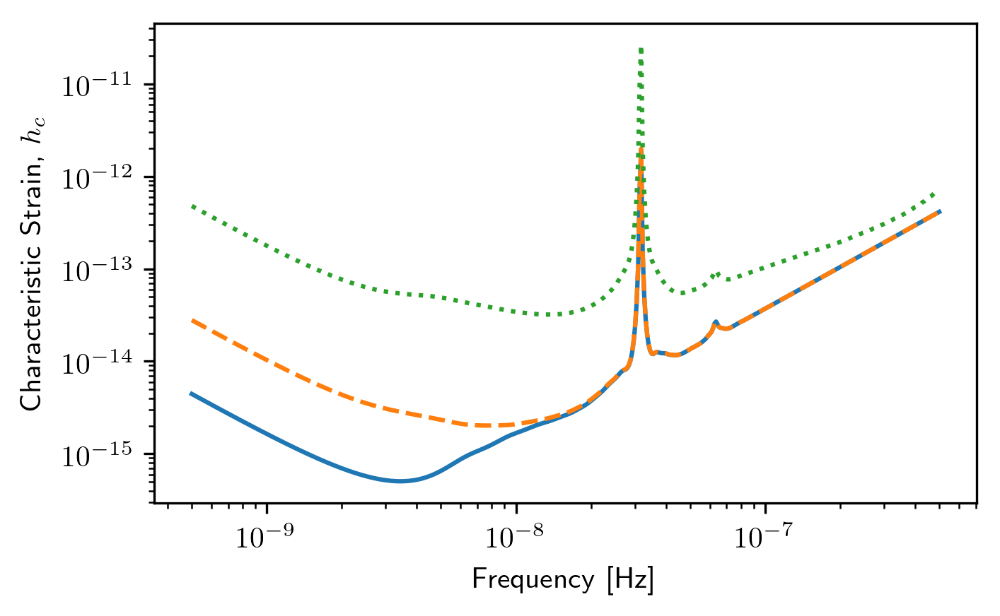
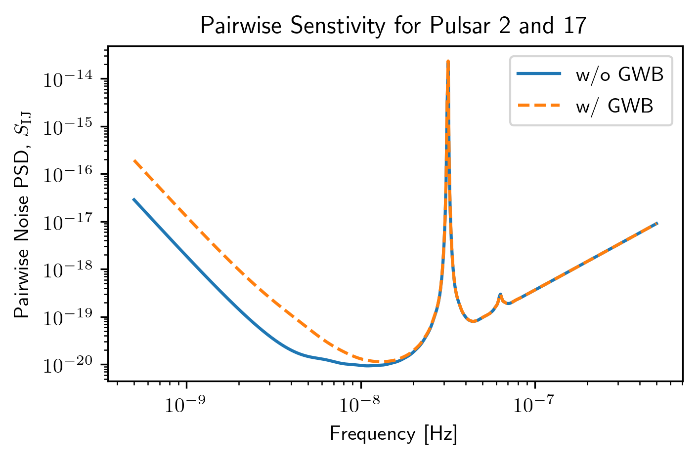

.. module:: hasasia

.. note:: This tutorial was generated from a Jupyter notebook that can be
          downloaded `here <_static/notebooks/sensitivity_tutorial.ipynb>`_.

.. _sensitivity_tutorial:

``GWBSensitivity and DeterSensitivity`` Tutorial
================================================

This tutorial is an introduction to the ``sensitivity`` module of the
pulsar timing array sensitivity curve package ``hasasia``. For an
introduction to sensitivity sky maps see later tutorials.

.. code:: python

    import numpy as np
    import matplotlib.pyplot as plt
    %matplotlib inline

.. code:: python

    import hasasia.sensitivity as hsen
    import hasasia.sim as hsim

.. code:: python

    import matplotlib as mpl
    mpl.rcParams['figure.dpi'] = 300
    mpl.rcParams['figure.figsize'] = [5,3]
    mpl.rcParams['text.usetex'] = True

After importing various useful packages, including the needed
``hasasia`` submodules, and setting some ``matplotlib`` preferences, we
instantiate 34 pulsar positions and timespans.

.. code:: python

    phi = np.random.uniform(0, 2*np.pi,size=34)
    cos_theta = np.random.uniform(-1,1,size=34)
    #This ensures a uniform distribution across the sky.
    theta = np.arccos(cos_theta)

.. code:: python

    timespan=[11.4 for ii in range(10)]
    timespan.extend([3.0 for ii in range(24)])

The simplest way to build a sensitivity curve is to use the
``hasasia.sim`` module to make a list of ``hasasia.sensitivity.Pulsar``
objects. One can use single values, a list/array of values or a mix for
the parameters.

.. code:: python

    psrs = hsim.sim_pta(timespan=timespan, cad=23, sigma=1e-7,
                        phi=phi,theta=theta)

If red (time-correlated) noise is desired for the pulsars then one first
needs to define a frequency array (in [Hz]) overwhich to calculate the
red noise spectrum.

.. code:: python

    freqs = np.logspace(np.log10(5e-10),np.log10(5e-7),500)

.. code:: python

    psrs2 = hsim.sim_pta(timespan=timespan,cad=23,sigma=1e-7,
                         phi=phi,theta=theta,
                         A_rn=6e-16,alpha=-2/3.,freqs=freqs)

These lists of pulsars are then used to make a set of
``hasasia.sensitivity.Spectrum`` objects. These objects either build an
array of frequencies, or alternatively take an array of frequencies,
over which to calculate the various spectra.

All frequency arras need to match across spectra and red noise
realizations.

.. code:: python

    spectra = []
    for p in psrs:
        sp = hsen.Spectrum(p, freqs=freqs)
        sp.NcalInv
        spectra.append(sp)

.. code:: python

    spectra2 = []
    for p in psrs2:
        sp = hsen.Spectrum(p, freqs=freqs)
        sp.NcalInv
        spectra2.append(sp)

Each spectra contains a number of attributes for that particular pulsar,
including the inverse-noise-weighted transmission function, and
sensitivity curve.

.. code:: python

    plt.loglog(spectra[0].freqs,spectra[0].NcalInv,
               label='w/o GWB, T={0} yrs'.format(timespan[0]))
    plt.loglog(spectra2[20].freqs,spectra2[20].NcalInv,'--',
               label='w/ GWB, T={0} yrs'.format(timespan[20]))
    plt.xlabel('Frequency [Hz]')
    plt.ylabel(r'$\mathcal{N}^{-1}_{\rm I}$')
    plt.legend()
    plt.show()

.. code:: python

    plt.loglog(spectra[0].freqs,spectra[0].S_I,label='w/o GWB')
    plt.loglog(spectra2[0].freqs,spectra2[0].S_I,'--',label='w/ GWB')
    plt.xlabel('Frequency [Hz]')
    plt.ylabel(r'$S_{\rm I}$')
    plt.legend()
    plt.show()

Senstivity Curves
-----------------

The list of spectra are then the input for the sensitivity curve
classes.

.. code:: python

    sc1a = hsen.GWBSensitivityCurve(spectra)
    sc1b = hsen.DeterSensitivityCurve(spectra)
    sc2a = hsen.GWBSensitivityCurve(spectra2)
    sc2b = hsen.DeterSensitivityCurve(spectra2)

.. code:: python

    plt.loglog(sc1a.freqs,sc1a.S_eff,label='w/o GWB')
    plt.loglog(sc2a.freqs,sc2a.S_eff,'--',label='w/ GWB')
    plt.xlabel('Frequency [Hz]')
    plt.ylabel(r'Effective Strain Noise PSD, $S_{\rm eff}$')
    plt.legend()
    plt.show()

.. code:: python

    plt.loglog(sc1a.freqs,sc1a.h_c)
    plt.loglog(sc2a.freqs,sc2a.h_c,'--')
    plt.xlabel('Frequency [Hz]')
    plt.ylabel('Characteristic Strain, $h_c$')
    plt.show()

.. code:: python

    plt.loglog(sc1a.freqs,sc1a.Omega_gw)
    plt.loglog(sc2a.freqs,sc2a.Omega_gw,'--')
    plt.xlabel('Frequency [Hz]')
    plt.ylabel('Energy Density, $\Omega_{gw}$')
    plt.show()

.. code:: python

    plt.loglog(sc1b.freqs,sc1b.h_c)
    plt.loglog(sc2b.freqs,sc2b.h_c,'--')
    plt.xlabel('Frequency [Hz]')
    plt.ylabel('Characteristic Strain, $h_c$')
    plt.title('Sensitivity Curves for Deterministic Signals')
    plt.show()

Multiple Values for Red Noise
-----------------------------

One can give each pulsar its own value for the red noise power spectrum.

.. code:: python

    A_rn = np.random.uniform(1e-16,1e-12,size=phi.shape[0])
    alphas = np.random.uniform(-3/4,1,size=phi.shape[0])

    psrs3 = hsim.sim_pta(timespan=timespan,cad=23,sigma=1e-7,
                         phi=phi,theta=theta,
                         A_rn=A_rn,alpha=alphas,freqs=freqs)

    spectra3 = []
    for p in psrs3:
        sp = hsen.Spectrum(p, freqs=freqs)
        sp.NcalInv
        spectra3.append(sp)

    sc3a=hsen.GWBSensitivityCurve(spectra3)
    sc3b=hsen.DeterSensitivityCurve(spectra3)

.. code:: python

    plt.loglog(sc1a.freqs,sc1a.h_c)
    plt.loglog(sc2a.freqs,sc2a.h_c,'--')
    plt.loglog(sc3a.freqs,sc3a.h_c,':')
    plt.xlabel('Frequency [Hz]')
    plt.ylabel('Characteristic Strain, $h_c$')
    plt.show()

Power Law-Integrated Sensitivity Curves
---------------------------------------

There are a few additional functions in the ``hasasia.senstivity``
module for calculating a power law-integrated noise curve for stochastic
senstivity curves.

First we use the ``Agwb_from_Seff_plaw`` method to calculate the
amplitude of a GWB needed to obtain an SNR=3 with the usual spectral
index, which is the default value of the spectral index.

.. code:: python

    hgw = hsen.Agwb_from_Seff_plaw(sc1a.freqs, Tspan=sc1a.Tspan, SNR=3,
                                   S_eff=sc1a.S_eff)

    #We calculate the power law across the frequency range for plotting.
    fyr = 1/(365.25*24*3600)
    plaw_h = hgw*(sc1a.freqs/fyr)**(-2/3)

The ``Agwb_from_Seff_plaw`` is used by the ``PI_hc`` method to
conveniently calculate the power law-integrated sensitivity across a
frequency range of the user's choice. The method returns the PI
sensitivity curve and the set of power law values solved for in the
process.

.. code:: python

    PI_sc, plaw = hsen.PI_hc(freqs=sc1a.freqs, Tspan=sc1a.Tspan,
                             SNR=3, S_eff=sc1a.S_eff, N=30)

.. code:: python

    for ii in range(plaw.shape[1]):
        plt.loglog(sc1a.freqs,plaw[:,ii],
                   color='gray',lw=0.5)
    plt.loglog(sc1a.freqs,plaw_h,color='C1',lw=2,
               label=r'SNR=3, $\alpha=-2/3$')
    plt.loglog(sc1a.freqs,sc1a.h_c, label='Stochastic Sensitivity')
    plt.loglog(sc1a.freqs,PI_sc, linestyle=':',color='k',lw=2,
               label='PI Stochastic Sensitivity')
    plt.xlabel('Frequency [Hz]')
    plt.ylabel('Characteristic Strain, $h_c$')
    plt.axvline(fyr,linestyle=':')
    plt.title('Power Law Integrated Stochastic Senstivity Curve')
    plt.ylim(hgw*0.75,2e-11)
    plt.text(x=4e-8,y=3e-16,
             s=r'$A_{\rm GWB}$='+'{0:1.2e}'.format(hgw),
             bbox=dict(facecolor='white', alpha=0.9))
    plt.legend(loc='upper left')
    plt.show()

.. image:: sensitivity_tutorial_files/sensitivity_tutorial_31_0.png

Here we see a fairly optimistic sensitivity at the SNR=3 threshold since
this PTA is made up of 100 ns-precision pulsars with no red noise.

Pairwise Senstivity Curves
--------------------------

One can also access each term of the series in the calculation of the
stochastic effective sensitivity curve. Each unique pair is available in
the ``GWBSensitivity.S_effIJ`` attribute. The pulsars can be identified
using the ``GWBSensitivity.pairs`` attribute.

.. code:: python

    plt.loglog(sc1a.freqs,sc1a.S_effIJ[79],label='w/o GWB')
    plt.loglog(sc2a.freqs,sc2a.S_effIJ[79],'--',label='w/ GWB')
    plt.xlabel('Frequency [Hz]')
    plt.ylabel(r'Pairwise Noise PSD, $S_{\rm IJ}$')
    p1,p2 = sc1a.pairs[:,79]
    plt.title(r'Pairwise Senstivity for Pulsar {0} and {1}'.format(p1,p2))
    plt.legend()
    plt.show()

