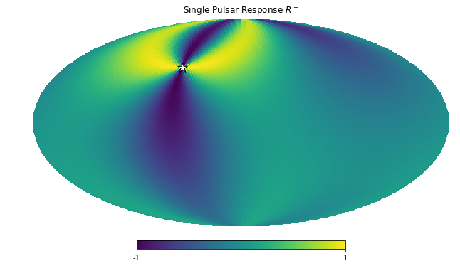
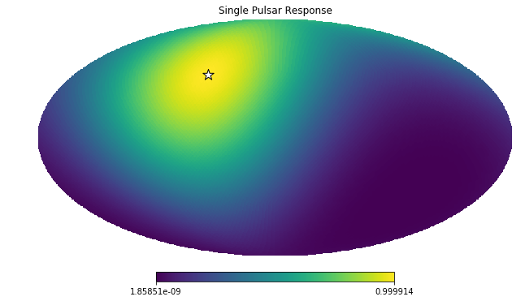
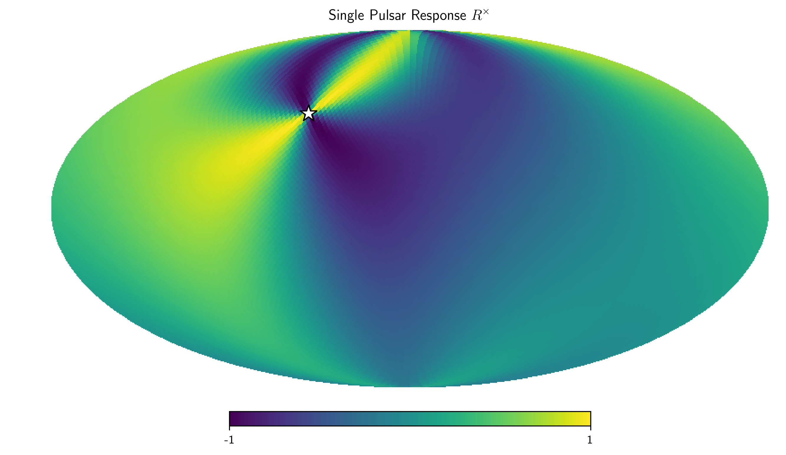
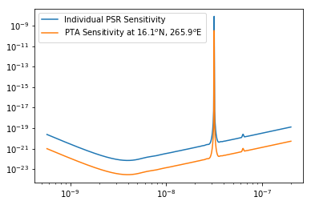
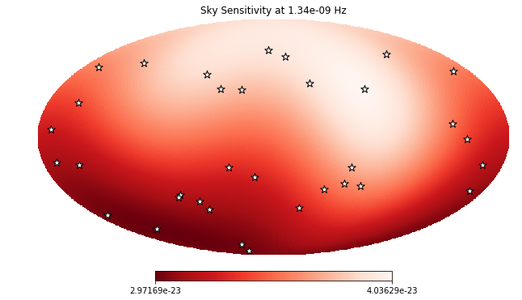
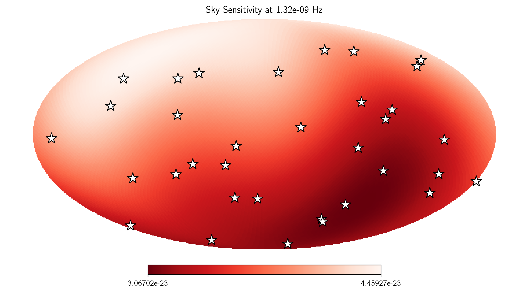
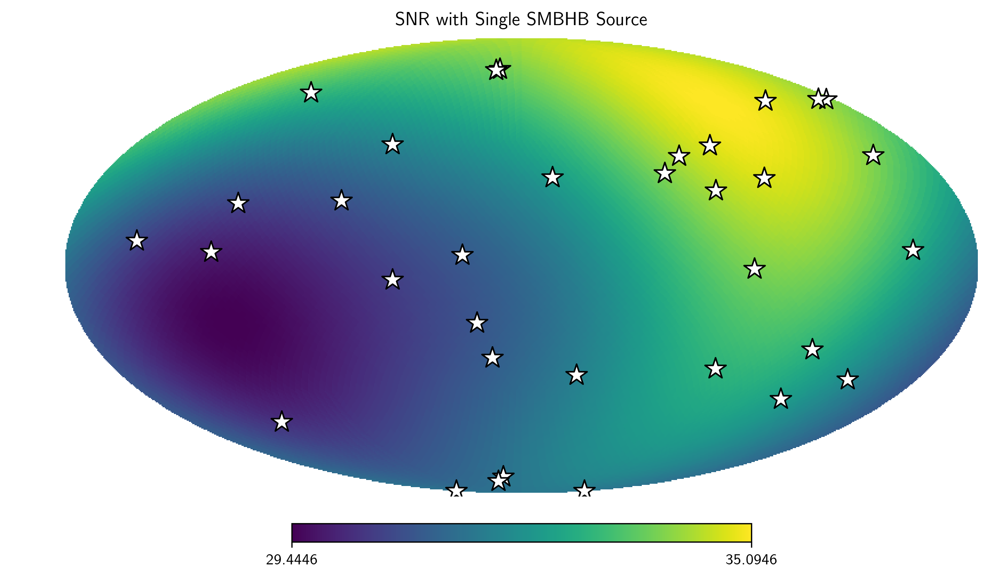
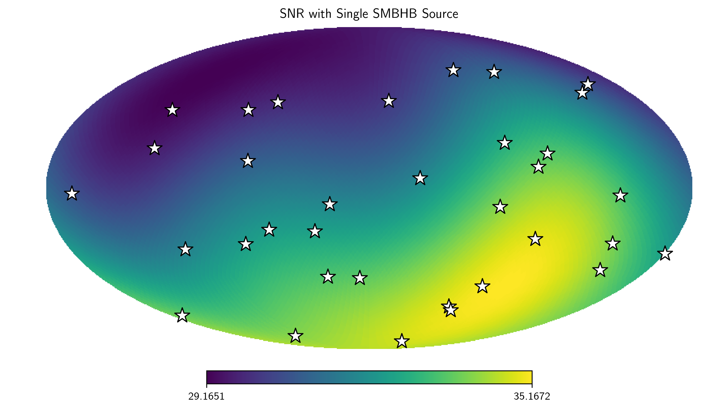
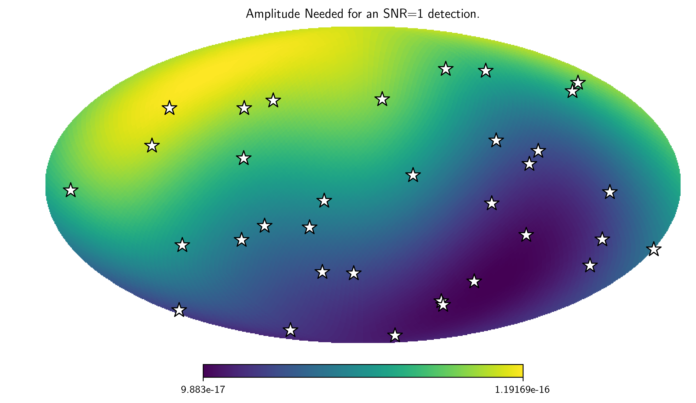

.. module:: hasasia

.. note:: This tutorial was generated from a Jupyter notebook that can be
          downloaded `here <_static/notebooks/skymap_tutorial.ipynb>`_.

.. _skymap_tutorial:

``SkySensitivity`` Tutorial
===========================

This tutorial is an introduction to the ``skymap`` module of the pulsar
timing array sensitivity curve package ``hasasia``. For an introduction
to straight forward sensitivity curves see prior tutorials.

.. code:: python

    #Import the usual suspects.
    import numpy as np
    import matplotlib.pyplot as plt
    %matplotlib inline
    # You'll need these packages to make the skymaps and deal with units. 
    import healpy as hp
    import astropy.units as u
    import astropy.constants as c

.. code:: python

    #Import the needed modules.
    import hasasia.sensitivity as hsen
    import hasasia.sim as hsim
    import hasasia.skymap as hsky

.. code:: python

    import matplotlib as mpl
    mpl.rcParams['figure.dpi'] = 300
    mpl.rcParams['figure.figsize'] = [5,3]
    mpl.rcParams['text.usetex'] = True

.. code:: python

    #Make a set of random sky positions
    phi = np.random.uniform(0, 2*np.pi,size=33)
    cos_theta = np.random.uniform(-1,1,size=33)
    theta = np.arccos(cos_theta)
    
    #Adding one well-placed sky position for plots.
    phi = np.append(np.array(np.deg2rad(60)),phi)
    theta = np.append(np.array(np.deg2rad(50)),theta)
    
    #Define the timsespans and TOA errors for the pulsars
    timespans = np.random.uniform(3.0,11.4,size=34)
    Tspan = timespans.max()*365.25*24*3600
    sigma = 1e-7 # 100 ns

Here we use the ``sim_pta`` method in the ``hasasia.sim`` module to
simulate a set of ``hasasia.senstivity.Pulsar`` objects. This function
takes either single values or lists/array as inputs for the set of
pulsars.

.. code:: python

    #Simulate a set of identical pulsars, with different sky positions. 
    psrs = hsim.sim_pta(timespan=11.4, cad=23, sigma=sigma,
                        phi=phi, theta=theta)

Next define the frequency range over which to characterize the spectra
for the pulsars and enter each ``Pulsar`` object into a
``hasasia.sensitivity.Spectrum`` object.

.. code:: python

    freqs = np.logspace(np.log10(1/(5*Tspan)),np.log10(2e-7),500)
    spectra = []
    for p in psrs:
        sp = hsen.Spectrum(p, freqs=freqs)
        sp.NcalInv
        spectra.append(sp)

Note above that we have called ``sp.NcalInv``, which calculates the
inverse-noise-weighted transmission function for the pulsar along the
way. For realistic pulsars with +100k TOAs this step will take the most
time.

Define a SkySensitivity Object
------------------------------

Before defining a ``hasasia.skymap.SkySensitivity`` object we will need
to choose a set of sky locations. Here we use the ``healpy`` Python
package to give us a healpix pixelation of the sky.

.. code:: python

    #Use the healpy functions to get the sky coordinates
    NSIDE = 32
    NPIX = hp.nside2npix(NSIDE)
    IPIX = np.arange(NPIX)
    theta_gw, phi_gw = hp.pix2ang(nside=NSIDE,ipix=IPIX)

Next enter the list of ``Spectrum`` objects and the sky coordinates into
the ``SkySensitivity`` class.

.. code:: python

    SM=hsky.SkySensitivity(spectra,theta_gw, phi_gw)

The ``SkySensitivity`` class has a number of accessible attributes and
methods. The polarization tensors :math:``e^+`` and :math:``e^-`` are
available.

.. code:: python

    hp.mollview(SM.eplus[1,1,:], title='$e_{11}^+$',)

One can also access the residual response functions for each of the
individual pulsars, as ``SkySensitivity.Fplus`` and
``SkySensitivity.Fcross``.

.. code:: python

    idx = 0
    hp.mollview(SM.Fplus[idx], fig=1,
                title="Single Pulsar Response $R^+$",min=-1,max=1)
    hp.visufunc.projscatter(SM.thetas[idx],SM.phis[idx],
                            marker='*',color='white',
                            edgecolors='k',s=200)
    hp.mollview(SM.Fcross[idx], fig=2,
                title=r"Single Pulsar Response $R^\times$",min=-1,max=1)
    hp.visufunc.projscatter(SM.thetas[idx],SM.phis[idx],
                            marker='*',color='white',
                            edgecolors='k',s=200)
    
    plt.show()

And the full residual response as ``SkySensitivity.sky_response``.

.. code:: python

    idx =0
    hp.mollview(SM.sky_response[idx], title="Single Pulsar Response")
    hp.visufunc.projscatter(SM.thetas[idx], SM.phis[idx],
                            marker='*',color='white',
                            edgecolors='k',s=200)
    plt.show()

The full frequency and sky location sensitivity information is available
as ``SkySensitivity.S_effSky``. The first index is across frequency,
while the second index is across sky position. Here we compare the
sensitivity from an individual pulsar to the full PTA's senstivity at a
particular sky position.

.. code:: python

    sky_loc = 'PTA Sensitivity at '
    sky_loc += '{0:2.1f}$^\circ$N, {1:2.1f}$^\circ$E'.format(np.rad2deg(theta_gw[252]),
                                                   np.rad2deg(phi_gw[252]))
    plt.loglog(SM.freqs,spectra[0].S_I, label='Individual PSR Sensitivity')
    plt.loglog(SM.freqs,SM.S_effSky[:,252],
               label=sky_loc)
    plt.legend(loc='upper left')
    plt.show()

Here we plot the ``SkySensitivity.S_effSky`` across the sky at a given
frequency.

.. code:: python

    idx = 73
    hp.mollview(SM.S_effSky[idx],
                title="Sky Sensitivity at {0:2.2e} Hz".format(SM.freqs[idx]),
                cmap='Reds_r')
    hp.visufunc.projscatter(SM.thetas,SM.phis,
                            marker='*',color='white',
                            edgecolors='k',s=200)
    plt.show()

Calculating SNR across the Sky
------------------------------

The ``SkySensitivity.S_effSky`` class comes with a method for
calculating the signal-to-noise ratio for a given signal. Rather than
calculate a signal from a single sky position, the method will calculate
the SNR from every sky position initially provided, given a particular
signal provided in strain across the frequency band.

There is a convenience function for circular binaries provided as
``hasasia.skymap.h_circ``.

.. code:: python

    hCirc = hsky.h_circ(1e9,200,5e-9,Tspan,SM.freqs).to('')

Here we plot the signal in the frequency domain, for a finite
integration time provided as the time span of the data set.

.. code:: python

    plt.semilogx(SM.freqs, hCirc)
    plt.xlabel('Frequency [Hz]')
    plt.ylabel(r'$\tilde{h}$')
    plt.show()

.. code:: python

    SNR = SM.SNR(hCirc.value[167])

.. code:: python

    idx = 167
    hp.mollview(SNR[idx],
                title="SNR with Single SMBHB Source",
                cmap='viridis')
    hp.visufunc.projscatter(SM.thetas,SM.phis,marker='*',
                            color='white',edgecolors='k',s=200)
    plt.show()

.. code:: python

    h_divA = (hsky.h_circ(1e9,200,5e-9,Tspan,SM.freqs)
              /hsky.h0_circ(1e9,200,5e-9)).value

.. code:: python

    Amp = SM.A_gwb(h_divA)

.. code:: python

    hp.mollview(Amp,
                title="Amplitude Needed for an SNR=1 detection.",
                cmap='viridis')
    hp.visufunc.projscatter(SM.thetas,SM.phis,marker='*',
                            color='white',edgecolors='k',s=200)
    plt.show()

